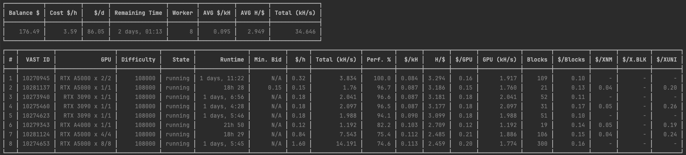

# Requirements

- Using [xenblocks.app](https://xenblocks.app/) official Vast.ai template.
- Node.js Version > 18.x
- Vast.ai API Key find at [https://cloud.vast.ai/account](https://cloud.vast.ai/account)

> To install Node.js see [https://nodejs.org/en/download](https://nodejs.org/en/download)

# Command

```shell
# Update VAST_AI_API_KEY=REPLACE_THIS_WITH_YOUR_VAST_API_KEY
cp .env.example .env

npm start
```


